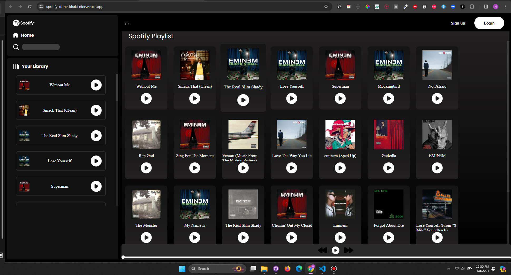

---

### Introduction
Welcome to the Spotify Clone project! This project aims to replicate the functionality and user experience of the popular music streaming platform, Spotify. By leveraging technologies like HTML, CSS, and JavaScript, along with integrating with the Deezer API, we've created a platform where users can browse, search, and play music seamlessly.

### Features
- **Search Functionality**: Users can search for songs, albums, or artists and get results fetched from the Deezer API.  
- **Play/Pause Songs**: Users can play and pause songs directly from the search results or the playbar.  
- **Responsive Design**: The application is designed to work seamlessly across different devices and screen sizes.  
- **Hamburger Menu**: Users can access navigation links through the hamburger menu icon, allowing for easy navigation.

### Technologies Used
- **HTML**: Used for structuring the web pages and creating the user interface.  
- **CSS**: Used for styling the user interface and making it visually appealing.  
- **JavaScript**: Used for adding interactivity and functionality to the application.  
- **Deezer API**: Integrated to fetch music data and enable search functionality.

### Setup Instructions
1. **Clone the Repository**: Use `git clone <repository-url>` to clone the project to your local machine.  
2. **Run the Application**: Open the `index.html` file in a web browser to run the application locally.  
3. **Start Exploring**: Start exploring music by using the search functionality, play/pause songs, and enjoy the Spotify-like experience!

### Deployed Live App
Check out the deployed live app [here](https://spotify-clone-khaki-nine.vercel.app/).

### Contributing
We welcome contributions from the community! Whether it's bug fixes, feature enhancements, or documentation improvements, feel free to submit a pull request. Please make sure to follow the project's coding standards and guidelines.

### Acknowledgments
- This project was inspired by the design and functionality of Spotify.  
- We acknowledge the creators and maintainers of the Deezer API for providing the data necessary to power our application.

### Preview

---

